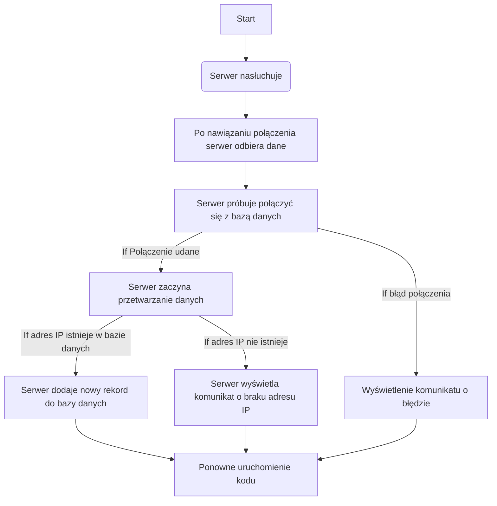

**Server tcp zapisujący odczyt z skanera w bazie danych**
```python
import mysql.connector,socketserver
```
importuje mysql.connector (odpowiada za łączenie z bazą danych mysql) i socketserver (tworzenie serwera tcp).
```python
class MyTCPHandler(socketserver.BaseRequestHandler):
	def handle(self):
		try:

			mydb = mysql.connector.connect(
			host="localhost",
			user="toor",
			password="ZAQ!2wsx",
			database="skany_base"
	)
	except:
		print('Nie udało się połączyć')
```
Funkcja handle() odpowiada za próbę połączenia się z serwerem mysql w momencie otrzymania informacji.
```python

	cursor = mydb.cursor()
	self.ip = self.client_address[0]
	self.data = self.request.recv(1024).strip()

	wynik = f"{self.ip}",int(self.data)
	query = "SELECT * FROM skanery WHERE ip = %s"
	cursor.execute(query, (self.ip,))
	result = cursor.fetchone()
	
	if result:

		print("IP Address exists in the database")
		query="insert into skany (ip, kod) values (%s, %s)"
		cursor.execute(query, wynik)
		mydb.commit()

	else:
		print("IP Address does not exist in the database")
		return
```
Jeśli index nie znajduje się w bazie danych to wyświetla błąd.
```python
	try:
		index = str(int(self.data))[0:4]
		query = "SELECT nazwa FROM artykul a WHERE RIGHT(CAST(indeks AS CHAR), 4) = %s"
		cursor.execute(query, (index,))
		result = cursor.fetchone()
		print(result)
		with open('output.txt', 'w') as file:
			file.write(str(result))
	except:
		print("błąd")
```
If result sprawdza czy skaner jest w bazie danych skanery, jeśli jest to dodaje rekord ip urządzenia i odczytany kod przez urządzenie.
```python
def server():
	HOST, PORT = "10.2.1.63", 8555
	with socketserver.TCPServer((HOST, PORT), MyTCPHandler) as server:
	server.serve_forever()

  
server()
```
Funkcja server() uruchamia server tcp.


**Włączenie servera tcp jako usługe w windows**
Importowanie potrzebnych funkcji
```python
import  socket
import  sys
import  win32serviceutil
import  servicemanager
import  win32event
import  win32service

```
```python
class  SMWinservice(win32serviceutil.ServiceFramework):
	_svc_name_  =  'servistcp_python_name'
	_svc_display_name_  =  'servistcp_python_name_displayname'
	_svc_description_  =  'Jakos dziala'

  

	def  parse_command_line(cls):

		win32serviceutil.HandleCommandLine(cls)
	def  __init__(self, args):

		self.proc  =  None

		win32serviceutil.ServiceFramework.__init__(self, args)

		self.hWaitStop  =  win32event.CreateEvent(None, 0, 0, None)

		socket.setdefaulttimeout(60)

  
```
**Svcstop** jest uruchamiana podczas zapytania zakończenia procesu
```python
	def  SvcStop(self):

	self.stop()

	self.ReportServiceStatus(win32service.SERVICE_STOP_PENDING)

	win32event.SetEvent(self.hWaitStop)

  
```
**SvcDoRun(self)** jest uruchamiana podczas zapytania uruchomienia 
```python
	def  SvcDoRun(self):
		self.start()
		servicemanager.LogMsg(servicemanager.EVENTLOG_INFORMATION_TYPE,
		servicemanager.PYS_SERVICE_STARTED,
		(self._svc_name_, ''))
		self.main()
		def  start(self):
			self.isrunning  =  True
		def  stop(self):
			self.isrunning  =  False
			sys.exit()
```
Główny kod serwera tcp.
```python
	def  main(self):
		#Tutaj znajduje się kod servera tcp zamieszczony powyżej
```
Jeśli aplikacja jest uruchamiana bezpośrednio to wywołuje funkcje SMWinservice.parse_command_line()
```python
if  __name__  ==  '__main__':
	SMWinservice.parse_command_line()
```


**Diagram aplikacji**
